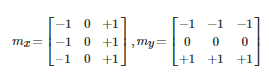
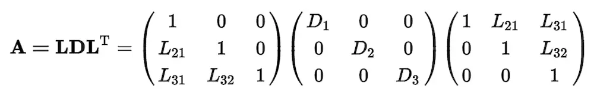
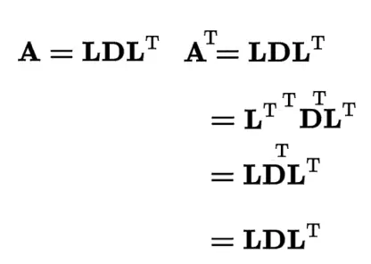
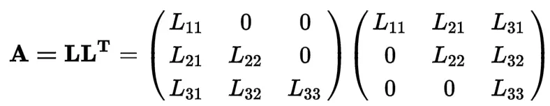
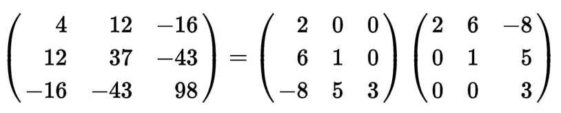
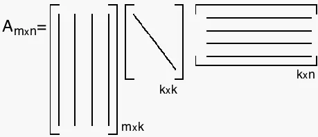
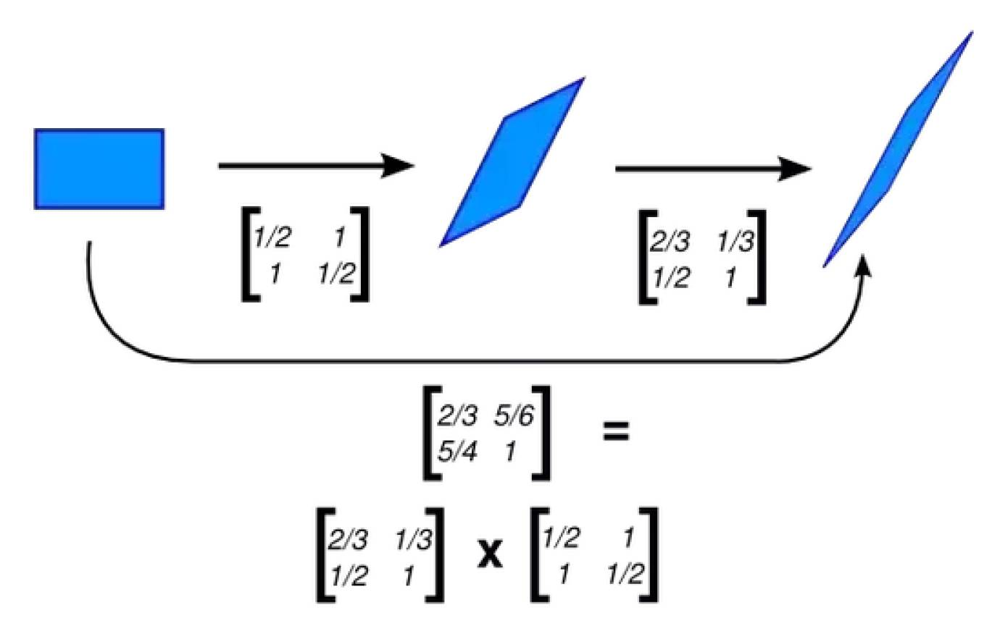
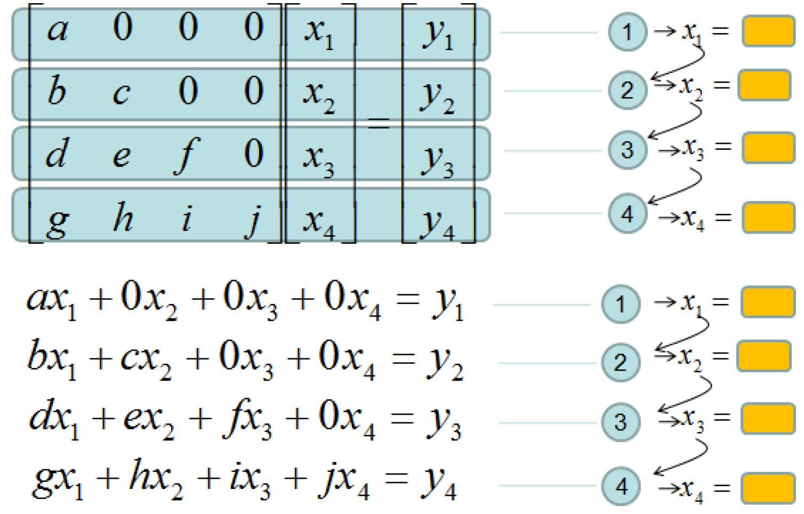
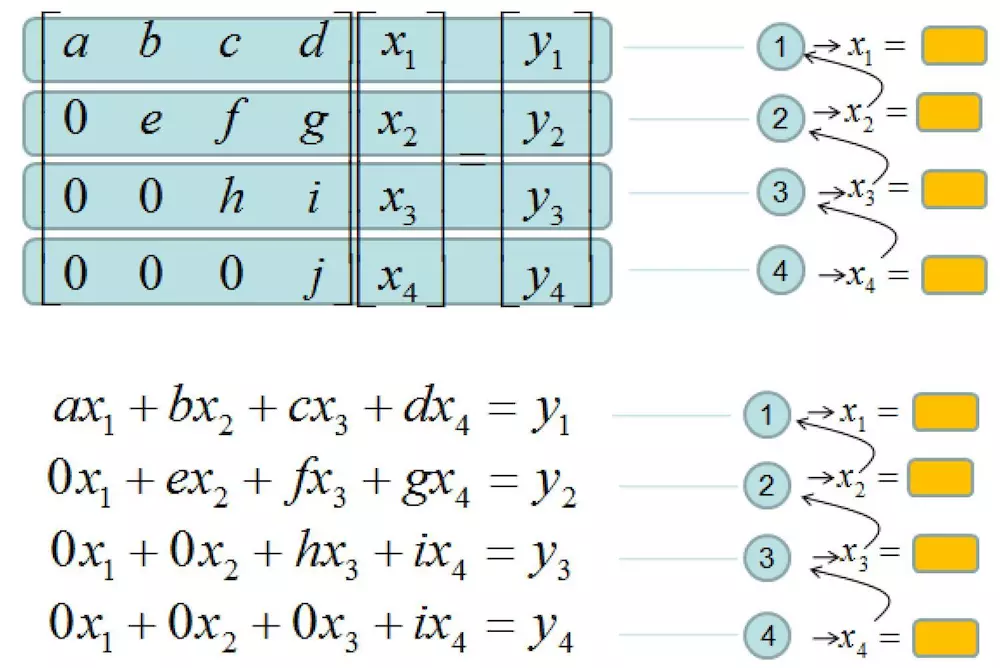

# 

# 矩阵分解

只有**当矩阵的秩为1时**，才可以分解为两个一维向量的乘积。

## 边缘检测

列举两种可以分解为两个一维向量的乘积的矩阵：

| Prewitt边缘检测算子                                  | Sobel边缘检测算子                                    |
| ---------------------------------------------------- | ---------------------------------------------------- |
|  |  |

还有其他的边缘检测算子。

## LU分解

LU分解， 故名思议就是， 把矩阵分成下三角矩阵（Lower）和上三角矩阵（Upper）的一种分解。 所以LU分解只用到了三角矩阵。下三角阵对角元是1，上三角是主元。对于**任意矩阵A**可以写成：

## LDU分解

而从LU分解到LDU分解是很容易做到的，只要把对角线的元素提取出来作为对角矩阵， 然后其他除以对角线元素进行等比例缩放。还可以写成A=LDU，其中D是对角阵，例如：

## LDL分解

此时的**矩阵A是对称矩阵：**

值得注意的是**A*A^T就是对称矩阵**

| 右边这个L的含义是左边的L的转置                         | A的转置和A是一样的                                     |
| ------------------------------------------------------ | ------------------------------------------------------ |
|  |  |
|  |  |

## QR分解

QR分解和SVD分解就要利用到正交矩阵。 Q是一个正交矩阵， 而R是一个上三角矩阵，前面我们提到单位矩阵也是正交矩阵， 所以正交矩阵可以看成是坐标系的转换。 所以有时候， QR分解也可以表示成如下形式。

| Q是一个正交矩阵， 而R是一个上三角矩阵                  | 正交矩阵可以看成是坐标系的转换。 所以有时候， QR分解也可以表示成如下形式。 |
| ------------------------------------------------------ | ------------------------------------------------------------ |
|  |        |

## SVD分解

SVD分解称为Singular value decomposition奇异值分解， 它是正交矩阵和对角矩阵的乘法分解。

| 它是正交矩阵和对角矩阵的乘法分解                       | 从形式上， SVD可以表示成如下：                         |
| ------------------------------------------------------ | ------------------------------------------------------ |
|  |  |

# 矩阵乘法的几何意义

如果把三角矩阵、对角矩阵 和 正交矩阵称为因子矩阵，因子矩阵的几何含义

## 对角矩阵

| 乘以一个对角矩阵，好比对每个坐标轴进行缩放        | 正数的乘法： 正数好比在原方向上的缩放， 大于1，表示伸长， 小于1，表示缩小。 |
| ------------------------------------------------- | ------------------------------------------------------------ |
|  |             |
|  |             |
## 三角矩阵

上三角矩阵： 上三角矩阵的作用好比进行右上的切变， **水平的斜拉**

## 正交矩阵

可以看一下正交矩阵的作用， 我们找可以利用一个正交矩阵， 找到对应乘法后的点的变化。

我们可以看到正交矩阵， 并不改变物体的形状， 但是进行了旋转。

## 矩阵分解的几何意义

| 综上所述， 矩阵因子的作用就是要把缩放， 切边， 和旋转分解出来理解一个矩阵的作用。 | 在这种情况下，矩阵乘法的分解就是连续进行几次变化的综合！ |
| ------------------------------------------------------------ | -------------------------------------------------------- |
|             |         |

> 需要注意的是以上只是对点的**位置变化进行了相应的分析**，而对于实际的图像操作还需要别外的分析。

## 优势

我们知道LU/LDU/LL/LDL分解和QR/SVD分解里面， 都有三角阵部分。 那么三角阵到底有什么优势呢？

LU分解的意义

LU分解使得矩阵AX=b的求解分成了LU两部分。

| 而三角矩阵的好处是可以很容易进行连续代入求解！               | 然后再进行上三角矩阵的求解。                           |
| ------------------------------------------------------------ | ------------------------------------------------------ |
|  |  |

三角阵进行方程求解的优势。

