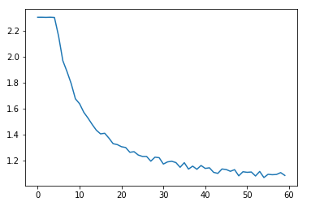
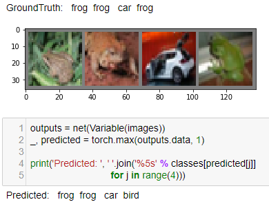
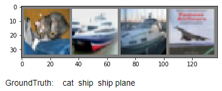
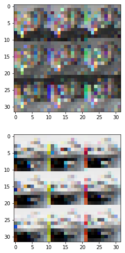
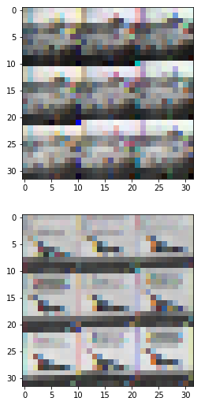
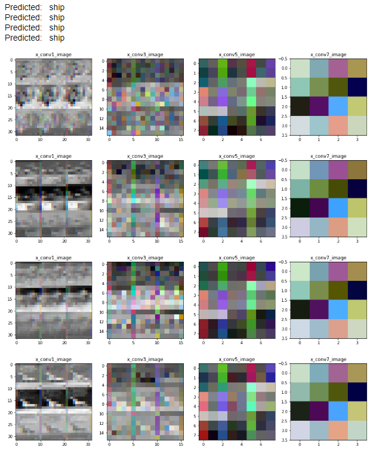
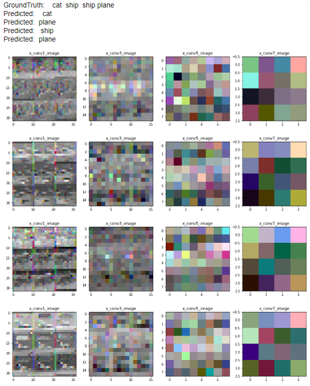

# 定义一个卷积网络

## 定义一个含有8层的全卷积网络，使用平均池化代替全连接层，做最终的分类，其中第1,3,5,7个卷积用来可视化

``` python
 class Net(nn.Module):
    def __init__(self):
        super(Net, self).__init__()
        # 卷积层 '1'表示输入图片为单通道, '6'表示输出通道数, '5'表示卷积核为5*5
        # 核心       
        self.conv1 = nn.Conv2d(3, 3, 3, padding = 1)
        self.conv2 = nn.Conv2d(3, 32, 3, padding = 1)
        self.conv3 = nn.Conv2d(32, 3, 3, padding = 1)
        self.conv4 = nn.Conv2d(3, 64, 3, padding = 1)
        self.conv5 = nn.Conv2d(64, 3, 3, padding = 1)
        self.conv6 = nn.Conv2d(3, 128, 3, padding = 1)
        self.conv7 = nn.Conv2d(128, 3, 3, padding = 1)
        self.conv8 = nn.Conv2d(3, 256, 3, padding = 1)
        self.AdaMaxPool = nn.AdaptiveMaxPool2d(1)
        self.fc1 = nn.Linear(256, 50)
        self.fc2 = nn.Linear(50, 10)

    def forward(self, x):
        #在由多个输入平面组成的输入信号上应用2D最大池化.
        # (2, 2) 代表的是池化操作的步幅

        x_conv1 = self.conv1(x)        
        x_conv1 = self.conv2(x_conv1)
        x_maxpool1 = F.max_pool2d(F.relu(x_conv1), 2)
        
        x_conv3 = self.conv3(x_maxpool1)        
        x_conv3 = self.conv4(x_conv3)
        x_maxpool2 = F.max_pool2d(F.relu(x_conv3), 2)
        
        x_conv5 = self.conv5(x_maxpool2)        
        x_conv5 = self.conv6(x_conv5)
        x_maxpool3 = F.max_pool2d(F.relu(x_conv5), 2)
        
        x_conv7 = self.conv7(x_maxpool3)        
        x_conv7 = self.conv8(x_conv7)
        x_maxpool4 = self.AdaMaxPool(F.relu(x_conv7))

        x = x_maxpool4.view(-1, x_maxpool4.size()[1])
        # 仿射层/全连接层: y = Wx + b
        x = F.relu(self.fc1(x))
        x = self.fc2(x)
        return x
```

## 训练损失



## 测试一个batch的预测结果



>Accuracy of the network on the 10000 test images: 60  %

## 测试数据集中的数据

### 一个batch的原图片





### 结果

| 随机初始化参数情况下                                         | 导入参数后                                                   |
| ------------------------------------------------------------ | ------------------------------------------------------------ |
|  |  |

### 测试自己的图片

