# 什么是卷积，为什么要卷积

## 卷积公式

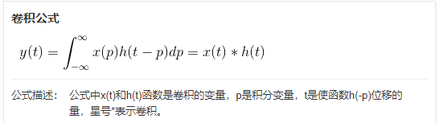

> 解释：t时刻的输出y(t)等于t时刻之前所有的输入x(p)与对应的权重系数h(t-p)的乘积之和。

### 计算其中的一个元素过程如下：

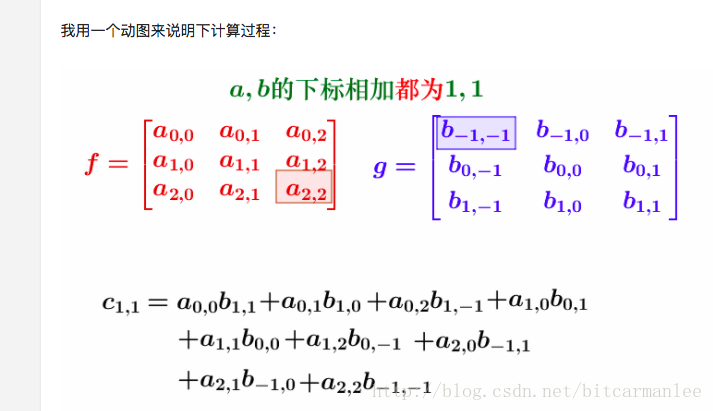

### 上述公式在离散信号上的解释

| 已知x[0] = a, x[1] = b, x[2]=c                              | 已知h[0] = i, h[1] = j, h[2]=k                              |
| ----------------------------------------------------------- | ----------------------------------------------------------- |
| 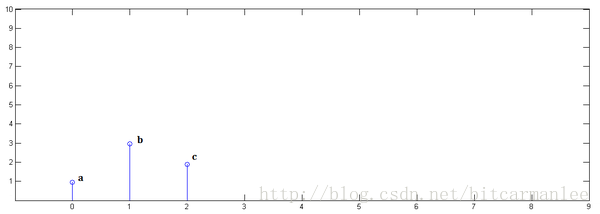 | 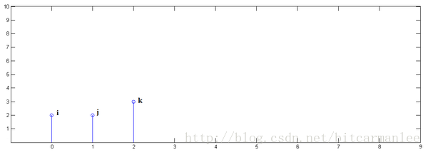 |

下面通过演示求x* h卷积过程，揭示卷积的物理意义：

| 第一步，x[n]乘以h[0]并平移到位置0：                         | 第二步，x[n]乘以h[1]并平移到位置1                           |
| ----------------------------------------------------------- | ----------------------------------------------------------- |
|  | 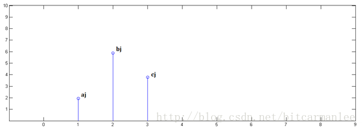 |
| 第三步，x[n]乘以h[2]并平移到位置2：                         | 最后，把上面三个图叠加，就得到了x* h：                      |
|  |    |

从这里，可以看到卷积的重要的物理意义是：一个函数（如：单位响应）在另一个函数（如：输入信号）上的加权叠加。

卷积的意义：加权叠加

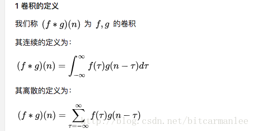

对上述运算使用卷积计算公式：
$$
y[0]=\sum x[p]*h[o-p]=x[0]*h[0-0]=x[0]*h[0]=a*i \\
y[1]=\sum x[p]*h[1-p]=x[0]*h[1]+x[1]*h[0]=a*j+b*i
$$

## 卷积有什么用

### 做多位数乘法

注意第二个等号右边每个括号里的系数构成的序列 (14,34,14,4)，实际上就是序列 (2,4) 和 (7,3,1) 的卷积。

**是“基”，是在这个基上的展开系数。两个多项式的乘积**在基上展开的系数就是**两个多项式各自在基上展开系数的卷积**。

对应着频率不同的，**系数对应着其傅里叶变换**。自然就是**傅里叶变换的乘积**等于**傅里叶变换的卷积**了。

### 卷积的内核

| 傅里叶变换                                                   | 欧拉公式                                                     |
| ------------------------------------------------------------ | ------------------------------------------------------------ |
|  |  |

## 对傅里叶变换的解释

傅里叶变换公式：

f(t)是t的[周期函数](https://baike.baidu.com/item/周期函数)，如果t满足[狄里赫莱条件](https://baike.baidu.com/item/狄里赫莱条件)：在一个以2T为周期内f(X)连续或只有有限个第一类间断点，附f（x）单调或可划分成有限个单调区间，则F（x）以2T为周期的傅里叶级数收敛，和函数S（x）也是以2T为周期的周期函数，且在这些间断点上，[函数](https://baike.baidu.com/item/函数)是有限值；在一个周期内具有有限个极值点；绝对可积。则有下图①式成立。称为积分运算f(t)的**傅立叶变换**：

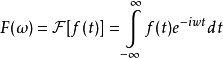

公式描述：

公式中F(ω)为f(t)的像函数，f(t)为F(ω)的像原函数。

对于满足狄里赫利(Dirichlet)条件的**周期信号**，**可以分解为一组成谐波关系的正弦信号**，或者说该周期信号做傅里叶变换可以得到一组傅里叶级数。

- 频率iw：

  对于周期信号，既然知道了其中的各个成分是成谐波关系的，那么频率成分就确定了。

- 幅值f(t)：

  所以在不考虑相位差的情况下，问题关键是如何得到这些成谐波关系的正弦信号前的**系数**（或者说，谐波的幅值，也即是各个成分的大小）。而傅里叶变换的公式恰恰就给了我们解决该问题途径。也就是本文最开始那个公式了。由待分析的周期信号*x*(*t*)，可以积分得到其中所包含的谐波成分的幅值ak，而将这些频率成分全部相加则可以重构出原周期信号。

### 个人简介

>傅里叶的一生很传奇，幼年时父母相继离世，二十多岁毕业后当了数学老师，后又被聘任为巴黎综合理工学院的教授。但他并不是一个安分的人，20岁的血气方刚恰逢当时的法国大革命，他的一些政治行动曾两次险些将其送上断头台，但他也因此获得了拿破仑的器重。
>
>三十岁时傅里叶跟随拿破仑东征，被任命为下埃及总督，并负责为法军的远征部队提供军火。在此期间，这个教过书、造过反、还给拿破仑背过枪的人竟然还向开罗埃及学院递交了几篇有关数学的论文。内容主要是关于他在三角级数方面的贡献。
>
>拿破仑远征军失败后，他回国并于1801年被任命为伊泽尔省格伦诺布尔地方长官。到了1807年，傅里叶在研究中发现了一系列成谐波关系的正弦曲线可以用来表示物体内的温度分布。他还声称，**“任何”周期信号都可以用一系列成谐波关系的正弦曲线来表示。**
>
>他随后向巴黎科学院呈交了这篇名为《热的传播》的论文，主审这篇文章的四个人中。**拉克尔华(F. Lacroix) 、蒙日(G. Monge)和拉普拉斯(P. S. de Laplace)都赞成发表这篇论文，但是拉格朗日(J. L. Lagrange)坚持拒绝傅里叶提出的这一套三角级数理论，因为在他看来，三角级数的适用范围及其有限，不可能把具有例如导数不连续的信号表现出来。**
>
>由于拉格朗日的强烈反对，导致傅里叶的这篇论文从未发表。在几次尝试让法国学院接受和出版他的论文后，傅里叶着手撰写他作品的另一个版本。1822年，傅里叶将这套理论写在了他的著作:《热的解析理论》之中。这距离他首次提出该理论已经过去了整整15年。

### 傅里叶变换示例

> 傅里叶认为：“任何”周期信号都可以用一系列成**谐波关系的正弦曲线**来表示。

| 获得制作橘子香蕉牛奶冰沙的比例                              | 经过过滤器得到的配比                                         |
| ----------------------------------------------------------- | ------------------------------------------------------------ |
| 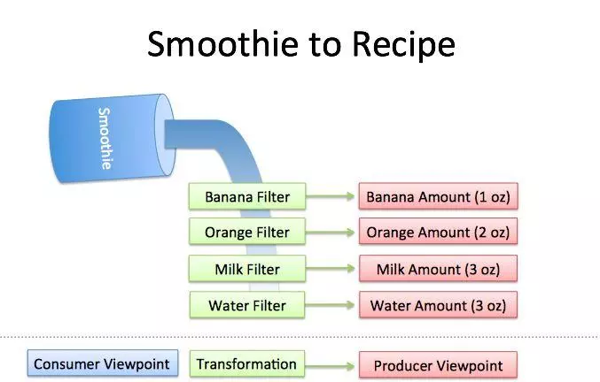 | 经过“香蕉过滤器”，得到1个单位量的香蕉； 经过“橘子过滤器”，得到2个单位量的橘子； 经过“牛奶过滤器”，得到3个单位量的牛奶； 经过“冰沙过滤器”，得到3个单位量的冰沙。 |

> 其中的，
>
> 1. 橘子香蕉牛奶冰沙==“任何”周期信号
> 2. 过滤器==傅里叶变换
> 3. 配比==一系列成谐波关系的正弦曲线

### 正弦信号的两种运动方式

| 一种是以时间为横轴、位移为纵轴，某一点的往复运动，也就是通常所说的正弦波，或者说是振荡信号 | 某一点绕另一点的匀速圆周运动。两种情况综合起来为下图所示。正弦波就是一个圆周运动在一条直线上的投影。 |
| ------------------------------------------------------------ | ------------------------------------------------------------ |
| 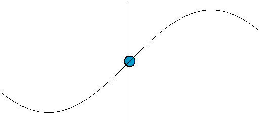  | 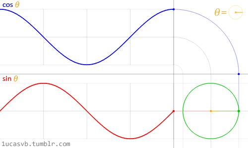  |

那么所有圆周运动（或振荡信号）组合起来得到的位置随时间的变化情况也就是我们最终的信号。这和从原材料得到最终的“橘子香蕉牛奶冰沙”过程类似。

同样，如果反过来，傅里叶级数能够将任何周期信号分解成一个（甚至是由无穷多个元素组成的）简单振荡信号的集合。

### 三种信号的合成：方波、锯齿波和三角波

#### 方波

虽然组成方波的这些信号都是正弦信号，但是这些正弦信号之间还需要满足一定的条件。考虑组成方波的正弦信号，方波可由以下公式表示，其中*n*为奇数：

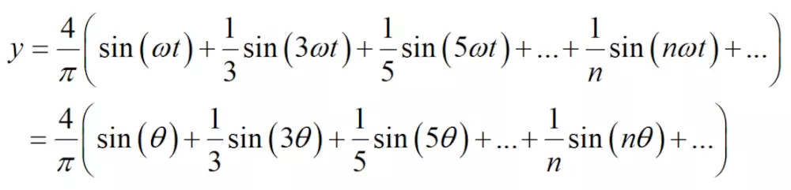

这里，*ω*称为基波频率，而3*ω*、5*ω*、*nω*等均为*ω*的整数倍。这些大于基波频率，且是**基波频率整数倍的各次分量称为谐波**。对于方波，基波的各偶数次谐波的幅值为零。**这些谐波成分也就是组成方波的原材料**。

| 方波也称为矩形波，但是这种“方方正正”的信号的确可以分解为无限多个正弦信号的组合。下图展示了方波的傅里叶级数的前50项的叠加过程，如果项数继续增加，则最终趋近方波。 | 时域的方波信号就被投影到了**频域**。时域的方波信号是以横轴为时间轴；频域中，横轴为频率。这样，一组随时间变化的时域正弦信号被表示为频域的一组离散点。频域每个离散点的横坐标代表一个谐波频率，而其纵坐标则代表该频率的谐波所对应的振动幅度。 |
| ------------------------------------------------------------ | ------------------------------------------------------------ |
| 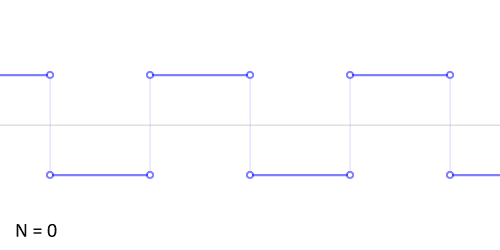  | 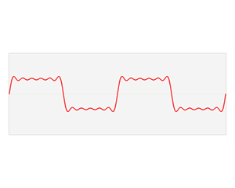  |
| 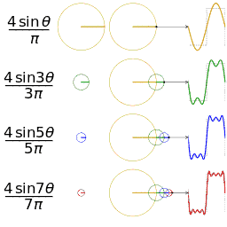  | 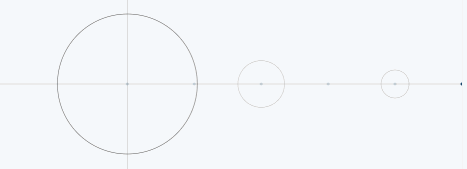 |

#### 锯齿波

考虑组成锯齿波的正弦信号，锯齿波可由以下公式表示，*n*为正整数：

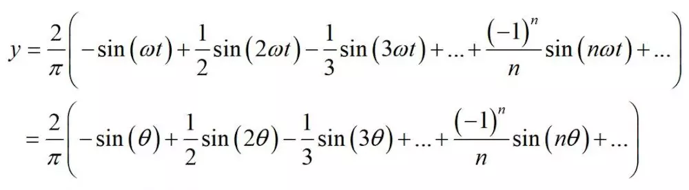

下图展示了锯齿波的傅里叶级数的前50项的叠加过程，如果项数继续增加，则最终趋近锯齿波。

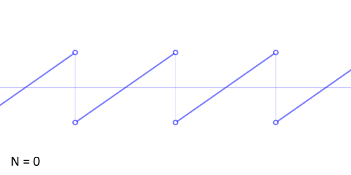

|                                                             |                                                             |
| ----------------------------------------------------------- | ----------------------------------------------------------- |
| 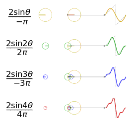 | 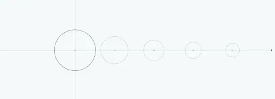 |

#### 三角波

| 对于三角波，与上面的两种类似，下图展示了三角波的傅里叶级数的前25项的叠加过程，如果项数继续增加，则最终趋近三角波 | 从圆周运动的角度看叠加过程如下图所示：                      |
| ------------------------------------------------------------ | ----------------------------------------------------------- |
| 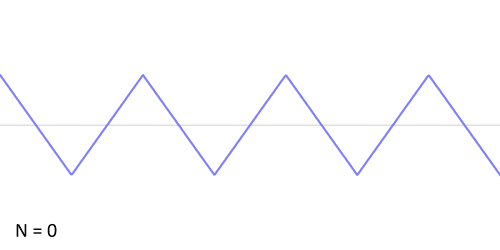  | 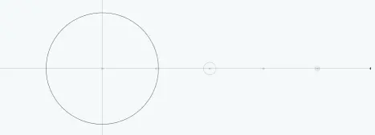 |

## 果壳上的一个解释 

比如说你的老板命令你干活，你却到楼下打台球去了，后来被老板发现，他非常气愤，扇了你一巴掌（注意，这就是输入信号，脉冲），于是你的脸上会渐渐地（贱贱地）鼓起来一个包，你的脸就是一个系统，而鼓起来的包就是你的脸对巴掌的响应，好，这样就和信号系统建立起来意义对应的联系。

下面还需要一些假设来保证论证的严谨：假定你的脸是线性时不变系统，也就是说，无论什么时候老板打你一巴掌，打在你脸的同一位置（这似乎要求你的脸足够光滑，如果你说你长了很多青春痘，甚至整个脸皮处处连续处处不可导，那难度太大了，我就无话可说了哈哈），你的脸上总是会在相同的时间间隔内鼓起来一个相同高度的包来，并且假定以鼓起来的包的大小作为系统输出。好了，那么，下面可以进入核心内容——卷积了！ 

如果你每天都到地下去打台球，那么老板每天都要扇你一巴掌，不过当老板打你一巴掌后，你5分钟就消肿了，所以时间长了，你甚至就适应这种生活了……如果有一天，老板忍无可忍，以0.5秒的间隔开始不间断的扇你的过程，这样问题就来了，第一次扇你鼓起来的包还没消肿，第二个巴掌就来了，你脸上的包就可能鼓起来两倍高，老板不断扇你，脉冲不断作用在你脸上，效果不断叠加了，这样这些效果就可以求和了，结果就是你脸上的包的高度随时间变化的一个函数了（注意理解）；

如果老板再狠一点，频率越来越高，以至于你都辨别不清时间间隔了，那么，求和就变成积分了。可以这样理解，在这个过程中的某一固定的时刻，你的脸上的包的鼓起程度和什么有关呢？和之前每次打你都有关！但是各次的贡献是不一样的，越早打的巴掌，贡献越小，所以这就是说，某一时刻的输出是之前很多次输入乘以各自的衰减系数之后的叠加而形成某一点的输出，然后再把不同时刻的输出点放在一起，形成一个函数，这就是卷积，卷积之后的函数就是你脸上的包的大小随时间变化的函数。

本来你的包几分钟就可以消肿，可是如果连续打，几个小时也消不了肿了，这难道不是一种平滑过程么？反映到剑桥大学的公式上.

> f(a)就是第a个巴掌，g(x-a)就是第a个巴掌在x时刻的作用程度，乘起来再叠加就ok了