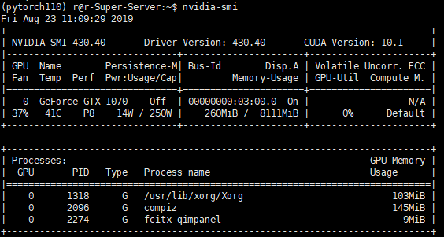
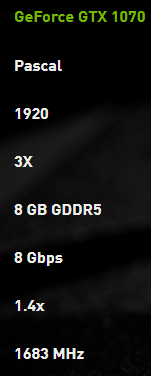
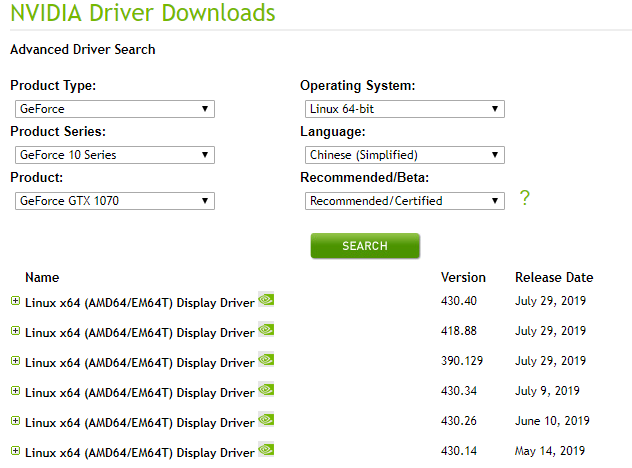
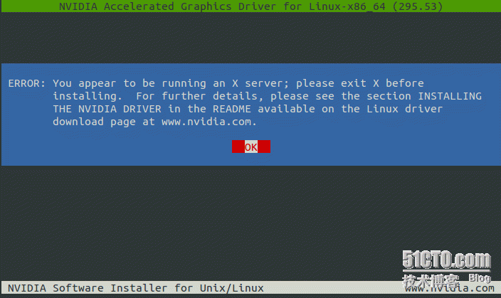
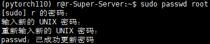
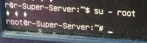

# 开始安装

可以通过xshell进行操作，很方便。

## 更改权限

将下载好的`NVIDIA-Linux-x86_64-430.40.run`复制到`/home`目录下，更改权限

```
sudo chmod a+x NVIDIA-Linux-x86_64-430.40.run
```

## 禁用X服务

```
sudo service lightdm stop
```

## 安装

按`Ctrl+Alt+F1`进入命令行，输入用户名密码登录（通过`Ctrl+Alt+F7`可返回界面，此时的数字键盘可能无法使用，可以使用右侧键盘上的数字输入密码）

```
sudo ./NVIDIA-Linux-x86_64-430.40.run -no-x-check -no-nouveau-check -no-opengl-files
```

- –no-opengl-files 只安装驱动文件，不安装OpenGL文件。这个参数最重要
- –no-x-check 安装驱动时不检查X服务
- –no-nouveau-check 安装驱动时不检查nouveau 

后面两个参数可不加。

安装完毕后重启验证是否安装成功：

```
nvidia-smi
```



出现以上类似的输出表示已经安装成功

## 启动显示服务

```
sudo service lightdm restart
```

------------------------------------------------

> 版权声明：本文为CSDN博主「墨成鱼」的原创文章，遵循CC 4.0 by-sa版权协议，转载请附上原文出处链接及本声明。
> 原文链接：https://blog.csdn.net/zhang970187013/article/details/81012845
# 服务器配置

## GPU信息

```shell
ren@r-Super-Server:~$ lspci |grep VGA
03:00.0 VGA compatible controller: NVIDIA Corporation GP104 [GeForce GTX 1070] (rev a1)
```



## 驱动选择

https://www.nvidia.com/Download/Find.aspx?lang=en-us



已保存到移动硬盘中`I:\软件\通用\服务器驱动`

## 验证GPU驱动是否安装成功

```shell
nvidia-smi
```


```
r@r-Super-Server:~$ uname -r
4.15.0-58-generic
```

# 驱动安装（这种方法目前最为方便）

（1）驱动安装：（这种安装方式很好，测试方便快捷）

```shell
(1)Ctrl+Alt+F1进入tty模式，登陆，注意密码输入不要使用右侧小键盘。有三个小菱形，注意直接输入密码即可
(2)sudo service lightdm stop
(3)sudo ./NVIDIA-Linux-x86_64-430.40.run -no-x-check -no-nouveau-check -no-opengl-files
```

> -no-x-check安装驱动时关闭x服务; 
> -no-nouveau-check 安装驱动时禁用Nouveau 
> -no-opengl-files 安装时只装驱动文件，不安装Opengl

（2）`sudo service lightdm restart`（可正常登录） 

# 西邮Windows服务器的pytorch环境配置

## 升级windows系统

## 安装VS

## 安装Anaconda

## 安装CUDA

## 安装CUdnn

# 卡在开机界面，用户的登陆界面死循环

原因：NVIDIA 驱动所致，之前安装方式nvidia驱动出问题。

## 解决办法：卸载nvidia驱动，重新安装。

（1）进入文本模式：CTRL+ALT+F1 
（2）Uninstall any previous drivers:

```shell
sudo apt-get remove nvidia-*
sudo apt-get autoremove
```

（3）Uninstall the drivers from the .run file:

```shell
sudo nvidia-uninstall
```

（4）此时，重启可login normally. 
（5）驱动重新安装：（这种安装方式很好，测试方便快捷）

```shell
(1)Ctrl+Alt+F1进入tty模式，登陆，注意密码输入不要使用右侧小键盘。
(2)sudo service lightdm stop
(3)sudo ./NVIDIA-Linux-x86_64-430.40.run -no-x-check -no-nouveau-check -no-opengl-files
```

> -no-x-check安装驱动时关闭x服务; 
> -no-nouveau-check 安装驱动时禁用Nouveau 
> -no-opengl-files 安装时只装驱动文件，不安装Opengl

（6）`sudo service lightdm restart`（可正常登录） 
（7）重启不会出现循环登录。 

> [Ubuntu 16.04 一直卡在开机界面或者用户登录界面死循环问题的解决](https://blog.csdn.net/zw__chen/article/details/79467189)

# 下面的东西仅供参考

# 安装驱动

## 卸载原有的NVIDIA驱动（没装的话就跳过）

一般方法

```shell
sudo apt-get remove –purge nvidia*
sudo apt-get autoremove
```

如果使用.run文件安装，使用--uninstall卸载（具体方法百度）

## 禁用nouveau

安装NVIDIA需要把系统自带的驱动禁用，打开文件：

```shell
sudo gedit /etc/modprobe.d/blacklist.conf
```


在文本最后添加以下内容：

``` shell
blacklist nouveau
option nouveau modeset=0
```

命令窗口会提示warn，无视之。

保存退出，执行以下命令生效：

```
sudo update-initramfs -u
```

重启电脑后输入：

```
lsmod | grep nouveau
```

没有任何输出说明禁用成功。


# 可能报错如下：

> 参考：[ERROR: You appear to be running an X server; please exit X before installing.](https://blog.51cto.com/8656934/1727329)

## ERROR: You appear to be running an X server; please exit X before installing.



## 解决办法：

### 进入tty模式

按`Ctrl+Alt+F1`进入tty命令行，输入用户名密码登录（通过`Ctrl+Alt+F7`可返回界面，此时的数字键盘可能无法使用，可以使用右侧键盘上的数字输入密码）

```
Localhostlogin: r
Password：
```

### 切换到根权限

#### 首先在正常模式下设置root用户

设密码，

```
sudo passwd root
```



> [ubuntu如何进入根用户](https://zhidao.baidu.com/question/161304723.html)

#### 在tty模式下，进入超级用户模式下：

```
[admin@localhost  ~]$ su – root
[root@localhost  ~]#
```

出现3个菱形，输入超级用户的密码即可。**注意：不要使用右侧小键盘上的数字**



### 输入init3进入文本模式

```
[root@localhost  ~]# init 3
```

返回图形界面`init 5`

### 找到NVIDIA-Linux-x86_64-430.40.run所在的文件夹

```shell
[root@localhost  ~]# cd /home/admin
[root@localhost  r]# ll
-rwxrwxrwx1 root root 69824601 Nov 10 01:48 NVIDIA-Linux-x86_64-430.40.run
```

运行安装文件

```
[root@localhost  r]# sh NVIDIA-Linux-x86_64-430.40.run
```

安装过程中根据相应提示，即可完成安装

# 过程

安装完成之后发现在登陆界面进入死循环，索性删除了Nvidia的驱动

```shell
sudo apt-get remove –purge nvidia*
sudo apt-get autoremove
```

`Ctrl+Alt+F7`返回桌面，仍然是无法进入

重启后可进入，驱动居然安装成功，莫名奇妙。。。。。`^_^`